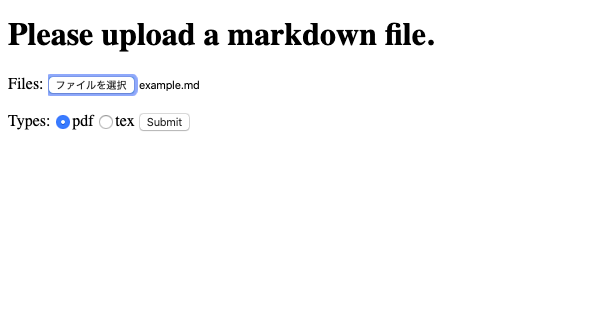
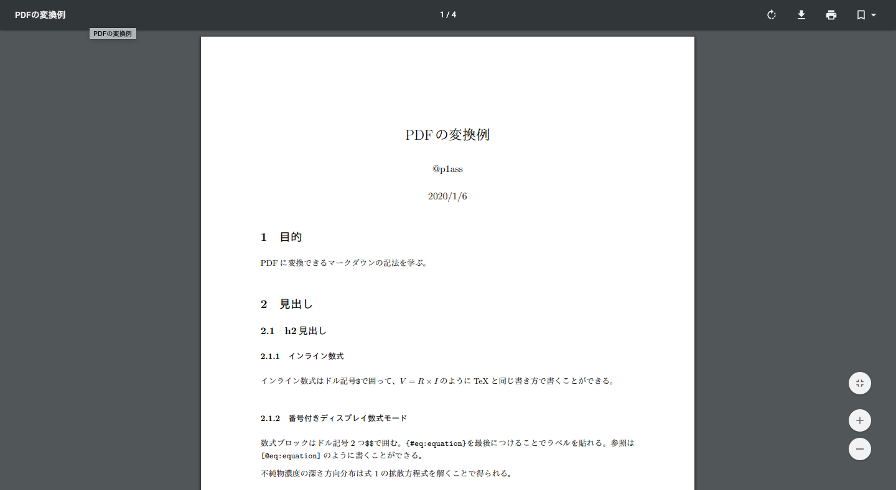

# MdPdF
p1assさんのhttps://github.com/p1ass/mdtopdfをwebアプリにしたもの

```sh
docker-compose up -d
# 作業するなら
docker-compose exec mdtopdf /bin/bash
go run main.go
```

# 環境
- docker-compose
- golang

# FrameWork・Library
- gin

# デモ




