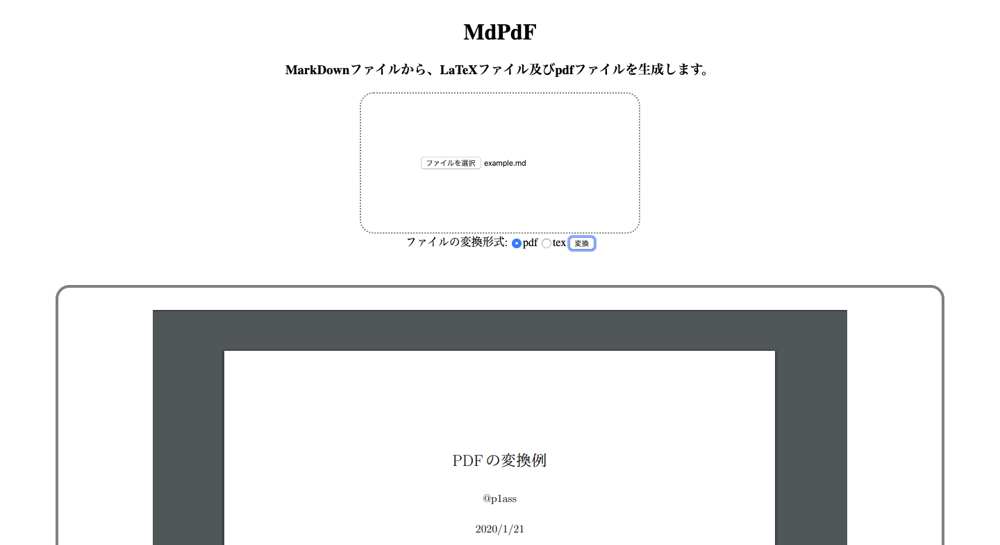

# MdPdF
p1assさんのhttps://github.com/p1ass/mdtopdf をwebアプリにしたもの

```sh
docker-compose up -d
# access to localhost:3000
```

# 環境
- docker-compose
- golang
- nginx
- java
- servlet

# FrameWork・Library
- gin

# デモ



